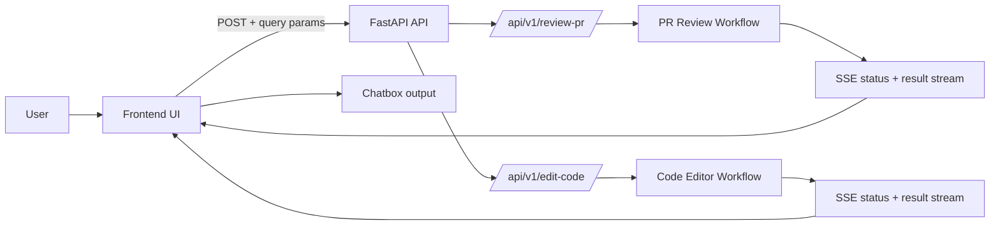

# Architecture

## Overview

This project is split into two main runtime layers:

- **FastAPI backend**: owns validation, routing, and workflow execution
- **Frontend browser UI**: collects inputs, starts streamed requests, and renders live chat output

Both APIs use streamed responses so the user can see intermediate progress before the final result arrives.

## Components

- `main.py`: app bootstrap, router registration, and middleware
- `api/pr_review.py`: SSE endpoint for PR review
- `api/code_editor.py`: SSE endpoint for code editor automation
- `workflow/pr_review/*`: PR review workflow graph and nodes
- `workflow/code_editor/*`: code editor workflow graph and nodes
- `frontend/`: static UI that talks to the backend

## Flow Diagram

## PR Review Flow

1. User enters a `pr_url` in the frontend.
2. Frontend locks the PR form and sends a `POST` request with the query parameter.
3. Backend validates the input and builds the initial PR review state.
4. Workflow emits live status updates over SSE.
5. Frontend appends each streamed message into the PR chatbox.
6. When the stream ends, the final structured review JSON is rendered in the chat.

## Code Editor Flow

1. User enters `workspace_path`, `user_prompt`, optional `file_path`, and a `mode`.
2. Frontend locks the code editor form and starts the streamed request.
3. Backend validates the input and routes execution based on the selected mode.
4. Workflow emits live status updates over SSE.
5. Frontend renders the streamed events in the code editor chatbox.
6. When the stream finishes, the final response is displayed.

## UI Behavior

- Only the active form is disabled while its request is running.
- The other panel remains usable because the two streams are independent.
- Loading indicators are shown until the stream closes.
- The chat transcript keeps both progress updates and the final output visible for demonstration.

